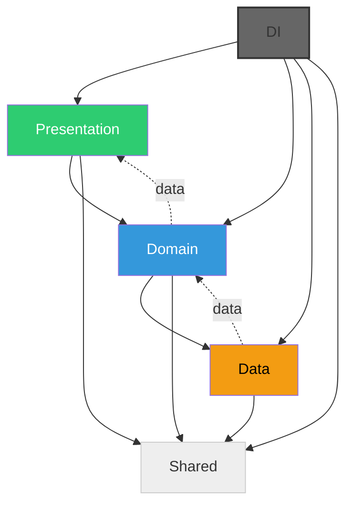
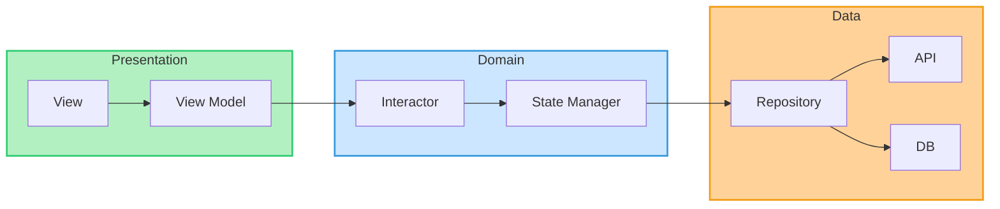

```mermaid
flowchart LR
    %% Презентационный слой
    subgraph Presentation
        direction LR
        subgraph Screens_Level["Screens level"]
            Screen1["Screen"]
            Screen2["Screen"]
        end

        subgraph Views_Level["Views level"]
            View1["View"]
            View2["View"]
            View3["View"]
            View4["View"]
            View5["View"]
        end

        subgraph ViewModels_Level["ViewModels level"]
            ViewModel1["View Model"]
            ViewModel2["View Model"]
            ViewModel3["View Model"]
            ViewModel4["View Model"]
        end
    end

    %% Доменный слой
    subgraph Domain
        direction LR
        subgraph Interactors_Level["Interactors level"]
            Interactor1["Interactor"]
            Interactor2["Interactor"]
            Interactor3["Interactor"]
            Interactor4["Interactor"]
            Interactor5["Interactor"]
            Interactor6["Interactor"]
        end

        subgraph StateManagers_Level["StateManagers level"]
            StateManager1["State Manager"]
            StateManager2["State Manager"]
            StateManager3["State Manager"]
        end
    end

    %% Слой данных
    subgraph Data
        direction LR
        subgraph Repositories_Level["Repositories level"]
            Repository1["Repository"]
            Repository2["Repository"]
        end

        subgraph Sources_Level["Sources level"]
            API1["API"]
            DB1["DB"]
            API2["API"]
            DB2["DB"]
            API3["API"]
            DB3["DB"]
        end
    end

    %% Взаимодействия
    Screen1 --> View1
    Screen1 --> View2
    Screen2 --> View3
    Screen2 --> View4

    View1 --> ViewModel1
    View2 --> ViewModel2
    View3 --> ViewModel3
    View4 --> ViewModel4
    View5 --> ViewModel3

    ViewModel1 --> Interactor1
    ViewModel2 --> Interactor2
    ViewModel3 --> Interactor3
    ViewModel4 --> Interactor4

    Interactor1 --> Interactor5
    Interactor2 --> Interactor5
    Interactor3 --> Interactor6
    Interactor5 --> StateManager1
    Interactor6 --> StateManager2
    Interactor4 --> StateManager3

    StateManager1 --> Repository1
    StateManager2 --> Repository1
    StateManager3 --> Repository2

    Repository1 --> API1
    Repository1 --> DB1
    Repository2 --> API2
    Repository2 --> DB2
    API2 --> DB2
    API1 --> DB1
    API3 --> DB3

     %% === Стили: Узлы ===
        classDef presentation fill:#a3e9a4,stroke:#2c7a2c,stroke-width:2px,color:#000
        classDef views fill:#6fdc6f,stroke:#2c7a2c,stroke-width:2px,color:#000
        classDef viewmodel fill:#57c757,stroke:#2c7a2c,stroke-width:2px,color:#000
        
        classDef domain fill:#77c9f7,stroke:#1d4ed8,stroke-width:2px,color:#000
        classDef interactor fill:#42a5f5,stroke:#1d4ed8,stroke-width:2px,color:#000
        classDef statemanager fill:#1e88e5,stroke:#1d4ed8,stroke-width:2px,color:#fff
    
        classDef data fill:#ffcc80,stroke:#ef6c00,stroke-width:2px,color:#000
        classDef repository fill:#ffa726,stroke:#ef6c00,stroke-width:2px,color:#000
        classDef source fill:#ffb74d,stroke:#ef6c00,stroke-width:2px,color:#000
    
        %% === Стили: Группы (области) ===
        classDef areaPresentation fill:#e8fce8,stroke:#2c7a2c,stroke-width:4px
        classDef areaDomain fill:#e3f2fd,stroke:#1565c0,stroke-width:4px
        classDef areaData fill:#fff3e0,stroke:#ef6c00,stroke-width:4px
    
        class Presentation areaPresentation
        class Domain areaDomain
        class Data areaData
    
        %% === Присвоение Узлам Классов ===
        class Screen1,Screen2 presentation
        class View1,View2,View3,View4,View5 views
        class ViewModel1,ViewModel2,ViewModel3,ViewModel4 viewmodel
    
        class Interactor1,Interactor2,Interactor3,Interactor4,Interactor5,Interactor6 interactor
        class StateManager1,StateManager2,StateManager3 statemanager
```


# Глоссарий



Например, состояние авторизации (токен, данные пользователя), состояние заказа (статус, данные заказ, etc), состояние конкретной фичи (данные этой фичи) и т.д.





&[Проверочный вопрос: “Можно ли использовать в случайном порядке два разных инстанса класса, не получив при этом проблем с консистентностью их работы?”. В качестве примера: объявление таких полей у класса, как StreamSubscription, Completer, флагов isDisposed и прочих похожие вещей, не касающихся бизнес-логики](205144), но влияющих на общее состояние класса как языковой единицы.



Эфемерное состояние — состояние, специфичное исключительно для конкретной части UI.

&[Бизнес-логика первого порядка — сфокусированная логика, результатом которой обязательно является изменение **только одного бизнес-состояния**.](205147)

Бизнес-логика второго порядка — комплексная логика, управляющая работой **нескольких бизнес-логик первого порядка**. Результатом может быть **изменением нескольких бизнес-состояния**.

StateReadable — интерфейс с двумя геттерами: `T get state` и `Stream<T> get stream`

# 1 Структура

1. Каждая фича состоит из следующих слоёв: Shared, Data, Domain, Presentation, DI.







**Зависимости между этими слоями** — серые стрелки означает направление зависимости (left-\>right: \[left\] зависит от \[right\]):


2. Shared не знает ни о каком другом слое, при этом любой другой слой знает о Shared-слоя.

3. Data-слой не зависит ни от чего, кроме,&[ опционально, ](205152)Shared&[-слоя.](205152)

4. 
   
   Это противоречит Clean, но упрощает разработку, при этом всё ещё остается одно-направленный поток данных. Поэтому тут отходим от Clean в пользу простоты.

   

5. Presentation слой зависит от Domain-слоя и, опционально, от Shared-слоя.

6. DI знает о существовании всего и зависит от всего.

**Поток данных между слоями** — фиолетовые стрелки означают направление потока данных (left\<-right: \[left\] получает данные от \[right\]):


Объединенная схема зависимостей и потока данных:


# 2 Правила

В общем случае (частные сценарии мы рассмотрим позже) каждый из слоев будет выглядеть так:







## 2.1 Data-слой


### 2.1.1 Общие принципы

1. Слой Data отвечает за read/write доступ к данным: backend сервисы в виде API, базы данных, сенсоры, и любые другие поставщики сырых данных

2. Слой Data содержит логику записи, обработки и трансформации данных в другое представление, но тоже данных

3. Внутреннее состояние Data слоя — опционально, только при необходимости (например, реализовать кэш данных)

### 2.1.2 Source

1. Source отвечает за сырой read/write интерфейс к данным.
2. Api — источник и потребитель данных, полученных с удаленного хранилища, бэкенда.
3. Storage — источник и потребитель данных, полученный с локального хранилища: база данных, файлы, SharedPreferences
4. Service — источник и потребитель данных,  которым выступает любой внешний модуль/библиотека и предоставляет некоторый контракт для работы. Например, LocationSDK, отдельная фича банка, и т.д.

### 2.1.3 Repository

1. Repository отвечает за запись, обработку и &[преобразование](205163) (маппинг, объединение) данных, направленную наружу (к Source) и вовнутрь (Domain-слой) приложения.

2. 
   
   Репозиторий — это семантически изолированная сущность для настройки взаимодействия с источниками данных, объединенными одним смыслом.

   Все связи между репозиториями делаются уже на уровне домена через StateManager — это его ответственность настраивать взаимодействие между разными репозиториями, для выполнения каких-то законченных смысловых операций с данными и состоянием.

   

### 2.1.4 Boundaries

1. Связь между Data и Domain слоем может быть организована одним из вариантов: Easy, Medium, Hard.

2. **Easy**: Domain знает о (здесь и далее = "может содержать в импортах путь до…")  Data. Data не знает о Domain. Domain работает напрямую с DataSource из Data.

3. **Medium**: Domain знает о Data. Data знает о Entity из Domain. Domain работает с Repository из Data.

4. **Hard**: Domain НЕ знает о Data. Domain содержит интерфейс Repository. Data знает о Entity и Repository из Domain — реализует Repository.

[Подробно с примерами](https://wiki.yandex-team.ru/taxi/partnerproducts/pro/architecture/guide/data-domain-relations/)

## 2.2 &[Domain-слой](205175)

Domain слой отвечает за предметную область и бизнес-логику продуктовой фичи.

### 2.2.1 Общие принципы

1. Состояние бизнес-логики первично

2. Domain-слой отвечает за бизнес-состояние приложения

3. Отвечает за поведение и бизнес-логику приложения

4. &[В domain-слое не может быть других сущностей, кроме StateManager и Interactor](204699)

5. Бизнес-состояние первично. Если у приложения есть какое-то состояние, вероятнее всего оно должно появиться как бизнес-состояние в domain-слое.

6. &[Импорт flutter в файлы domain-слоя запрещен. Исключение импорта flutter: a) импорт globalKey или materialPage (showDialog, etc) в файле с реализацией NavigationInteractor](205169), b) импорт PlatformChannel-ов для описания Interactor, который работает с нативом через каналы.

7. Если нужно изменять несколько бизнес-состояний — нужен отдельный Interactor с зависимостями на несколько соответствующих StateManager

8. По умолчанию с Data-слоем могут взаимодействовать только StateManager. Исключение — простые случаи, когда с data-слоем можно работать напрямую из Interactor: для работы с данными из Repository вообще не нужно состояние (например, write-only действие).


### 2.2.2 StateManager

 1. Реализует интерфейс StateReadable

 2. StateManager всегда хранит бизнес-состояние

 3. StateManager содержит в себе бизнес-логику первого порядка — относящуюся только к своему бизнес-состоянию

 4. StateManager может мутировать только своё состояние

 5. &[StateManager может использовать асинхронные методы, в рамках которых выполнять ](205174)мутацию своего состояния.

 6. В StateManager должна быть только та логика, результатом работы которой является изменение только его бизнес-состояния

 7. Для работы с data-слоем использует Repository.

 8. StateManager может взаимодействовать с другими Source из data-слоя, помимо Repository в двух случаях: 1) если этот Source не используется нигде больше, кроме этого StateManager, 2) если нет других Source из data-слоя, с которыми должен взаимодействовать StateManager. Если хотя бы одно из условий не выполняется — нужен Repository.

 9. &[Не может зависеть от StateManager](204708)

10. &[Не может зависеть от Interactor](204709)

11. Бизнес-состояния не должны дублировать данные друг друга. Если данные можно получить комбинацией нескольких бизнес-состояний — это нужно делать маппингом, и не складывать в дополнительное бизнес-состояние.

12. 
    
    Запрет доступа к StateManager реализуется либо на уровне договоренностей, либо на уровне пакетов {orange}(\[если придумаем как\])

    Основной пример — это NavigationStateManager и NavigationInteractor — переходы на экраны.

    

13. 
    
    &[Это необходимо, чтобы один и тот же маппер использовался как для синхронного геттера, так и для геттера со стримом. При этом ни State, ни StateManager не зависили от модели данных, в которую нужно состояние конвертировать.](205183)

    ```
    class MyState {
    }
    
    // Так — ок
    extension MyStateToMyData on MyState {
      MyData get asMyData {
        // convert state to myData
      }
    }
    
    // Так — ок
    class MyStateMapper {
      static MyData get mapMyStateToMyData(MyState state) {
        // convert state to myData
      }
    }
    
    void main() {
      // так — ок
      final myData = myStateManager.state.asMyData;
      myStateManager.stream.map((state) => state.asMyData).listen(...);
    
      // так — ок
      final myData = MyStateMapper.mapMyStateToMyData(myStateManager.state);
      myStateManager.stream.map(MyStateMapper.mapMyStateToMyData).listen(...);
    
      // ТАК — НЕ ОК
      final myData = myStateManager.myData;
      myStateManager.stream.myDataStream.listen(...);
    }
    ```

    

### 2.2.3 Interactor

1. Interactor не хранит бизнес-состояние

2. Interactor может хранить сервисное состояние

3. Если появляется необходимость в бизнес-стейте — из Interactor обязан выноситься новый StateManager, либо Interactor должен превращаться в StateManager

4. По умолчанию методы Interactor порождают сайдэффекты, вызывая методы своих зависимостей — это ожидаемое поведение. При этом Interactor может не зависеть от StateManager или других зависимостей и содержать функции, которые возвращают значение на основе выполненной бизнес-логики, входных аргументов функции — чистые функции.

5. Interactor может зависеть от многих StateManager

6. Interactor может зависеть от многих Interactor

7. Рекомендуется использовать реактивный подход для запуска бизнес-логики — т.е. триггером для начала выполнения бизнес-логики является изменение состояния. Т.е. есть Interactor подписывается на StateReadable и когда бизнес-состояние меняется определенным образом — вызывает методы своей бизнес-логики.

8. 
   
   Это может быть необходимо, если какие-то методы бизнес-логики необходимо выполнить строго последовательно.

   

9. Если нужно много разнородных проверок состояния, то делается один общий Interactor и в него передается несколько Interactor с интерфейсом Interceptor (интерфейс уникальный для конкретного случая). И через DI все реализации Interceptor передаются в единый Interactor, который будет их обходить и принимать решение.

### 2.2.4 StateProvider

1. StateProvider — read-only реализация StateReadable, объединяющая данные из нескольких StateManager.

2. StateProvider нужно использовать только для создания комплексных domain-моделей на основе двух и более StateManager.

3. &[Объединенные данные из StateProvider предназначены  для использования в Domain-слое.](353694)

## 2.3 Presentation-слой

### 2.3.1 Общее

1. Presentation слой — это UI фичи, то как происходит построение экранов и виджетов.

2. Логика преобразования состояния в UI

3. Логика обработки событий от UI и их передача в бизнес-логику

4. Визуальное отображение — UI

5. Эфемерное состояние всегда опционально


### 2.3.2 ViewModel

 1. ViewModel возвращает ViewObject — данные для отображения, преобразованные из бизнес-состояния и/или эфемерного состояния

 2. 
    
    Почему:

    1. Наличие флаттерных сущностей во ViewModel размывает зону ответственности — становится сложно определить, что из флаттера может/должно быть в ViewModel, а что может/должно остаться в State. Строгий запрет на Flutter эту границу хорошо фиксирует — всё флаттерное должно быть только в виджетах и стейтах.

    2. BuildContext имеет свой жизненный цикл, а ViewModel живет по своему ЖЦ. Если давать доступ к флаттерным сущностям в ViewModel, то нужно учиться гарантировано обеспечивать симметричность их ЖЦ. А это усложняет и логику работы, и поддержку. "Avoid storing instances of [BuildContext](https://api.flutter.dev/flutter/widgets/BuildContext-class.html)s because they may become invalid if the widget they are associated with is unmounted from the widget tree. If a [BuildContext](https://api.flutter.dev/flutter/widgets/BuildContext-class.html) is used across an asynchronous gap (i.e. after performing an asynchronous operation), consider checking [mounted](https://api.flutter.dev/flutter/widgets/BuildContext/mounted.html) to determine whether the context is still valid before interacting with it" ([дока](https://api.flutter.dev/flutter/widgets/BuildContext-class.html))

    

 3. ViewModel не хранит бизнес-состояние

 4. ViewModel может хранить сервисное-состояние

 5. ViewModel может хранить эфемерное состояние. Для этого используется StatefulViewModel.

 6. ViewModel может зависеть только от Interactor и StateReadable

 7. ViewModel не могут зависеть друг от друга

 8. Во ViewModel не должна зависеть от StateManager\* (исключение смотри в след пункт). Если нужно бизнес-состояние от StateManager, ViewModel подписывается на StateReadable, предоставляемый таким StateManager.

 9. Если ViewModel есть и ей нужно вызывать действия, которые есть в StateManager, но при этом нет промежуточного Interactor (или в целом нет Interactor и бизнес-логики второго порядка), то ViewModel может иметь прямую зависимость на StateManager.

10. ViewModel может зависеть от интерфейса StateReadable — для read-only доступа к бизнес-состоянию и преобразованию его во ViewObject

11. ViewModel может зависеть от Interactor — для вызова методов с бизнес-логикой

12. ViewModel может зависеть от сервисных сущностей: Analytics, Logger и т.д.

13. 
    
    Это нужно, чтобы бизнеслогика не копилась в ViewModel.

    {orange}(Если вызовы Interactor нужны — стоит вынести это в отдельный Interactor \(либо в тот же самый, который хочется вызывать\).)

    

14. 
    
    Например, открытость/закрытость шторки для одной ViewModel может быть флагом isOpened, но если это становится нужно двум ViewModel, то флаг переименовывается в isDetailed и уносится в одной из бизнес-состояний, либо заводится новое, вместе с StateManager.

    

15. Всё эффемерное состояние, относящееся к фреймворку (ScrollController, AnimationController, TextEditingController и т.д.), должно находиться в Widget-слое в соответствующих StatefulWidget.

16. Если нужна двусторонняя синхронизация (сохранять эфемерное состояние данных в ScrollController/TextEditingController и т.д.), то во ViewModel нужно выполнять действия через событий SingleEvent, которые отправляются и обрабатываются на стороне Widget-слоя.

17. Для ViewObject можно использовать AsyncValue в нашей реализации. Можно использовать AsyncValue внутри ViewObject, можно использовать AsyncValue как корневой класс ViewObject, можно обойтись без AsyncValue и сделать самописный класс — sealed или обычный.

18. ViewModel должна быть реализована с помощью [yx\_view\_model](https://a.yandex-team.ru/arcadia/flutter/pro/flutter_pub/packages/yx_view_model).

19. ViewModelProvider — отвечает за 3 задачи: инстанцирует ViewModel, управляет её жизненным циклом и прокидывает в поддерево виджетов.

20. ViewModel должна инстанцироваться непосредственно в месте создания: `ViewModelProvider(create: YourViewModel())` — таким образом ViewModel будет привязана к жизненному циклу этого поддерева.

21. ViewModelConsumer — подписывается на ViewModel, которая доступна из ViewModelProvider выше по дереву.

22. ViewModelProvider.of(context) — альтернатива ViewModelConsumer. Подписывается на ViewModel, которая доступна из ViewModelProvider выше по дереву.

### 2.3.3 Widget / View

1. Может зависеть только от ViewModel\* (исключение см в след пункт).

2. Если Widget не содержит событий от пользователя и не требует комплексного преобразования бизнес-состояния в отображение (оба критерия должны выполняться) — можно не делать ViewModel и напрямую использовать StateReadable в этом Widget.

3. View (Widget) могут составлять композицию из друг от друга — следовательно виджет-родитель знает (= импортирует) о дочернем виджете.

4. Widget принимает ViewObject от ViewModel и может делать срез ViewObject до отображения конкретного поля.

5. Если нужно вычислить какие-то значения на основе параметров Widget, то эти параметры можно передать в ViewModel, чтобы там сделать вычисления.

### 2.3.4 Screen

1. Объединяет View в единый экран

2. Может иметь свою ViewModel

## &[2.4 ](205160)Shared&[-слой](205160)

1. Ключевой критерий shared-слоя — у него нет никаких зависимостей &[(нет импортов на другие файлы этой фичи за пределами shared-слоя)](353699).

2. Shared-слой может быть специфичен для конкретных слоёв/фичей, но п.1 всё равно должен соблюдаться. Специфичность для слоя нужна для удобства и декомпозиции на слои.

3. Shared-слой содержит типы данных, используемые в разных слоях

4. Shared-слой содержит алгоритмические чистые функции, используемые в разных слоях (утилиты)

## 2.5 DI

1. DI отвечает за связь слоёв

2. Создание инстансов всегда должно быть строго отделено от инициализации

3. 
   
   Тут мы говорим именно про ЖЦ относящийся в DI — т.е. скоупы. Один объект в скоупе живет то время, пока живет скоуп — не дольше, но и не короче. И init/dispose вызываются на одном объекте строго по одному разу. Всё это сделано для строгой предсказуемой детерминированности, чтобы ЖЦ всегда вел себя одинаково предсказуемо.
   Если нужен какой-то свой кастомный ЖЦ и в нём должны быть многоразовые вызовы — стоит делать его не в DI и возможно как-то иначе обзывать методы такого ЖЦ.

   

4. Зависимости должны собираться в дерево зависимостей строго на этапе компиляции. Не должно быть ленивого доступа к зависимостям внутри других сущностей (late, get, etc)

5. Связывание зависимостей полностью должно быть реализовано с помощью [yx\_scope](https://github.com/yandex/yx_scope). [Статья по работе с yx\_scope](https://habr.com/ru/companies/yandex/articles/852278/).

6. Каждый скоуп должен быть интерфейсом `SomeScope` с геттерами. Этот интерфейс реализует `ScopeContainer` — `ScopeContainer implements SomeScope`.

7. Каждый дочерний скоуп должен содержать описание интерфейса для своего родителя — `SomeScopeParent`. Родительский контейнер должен имплементить интерфейс каждого дочернего скоупа — `RootScopeContainer extends ScopeContainer implements RootScope, SomeScopeParent`.

8. Холдеры должны использовать базовые сущности `BaseScopeHolder/BaseChildScopeHolder/BaseChildDataScopeHolder` и типизировать их интерфейсами.

## Полная схема






# 3 Собираем все вместе

В следующих статьях дается детальнее представление о том, как может выглядеть продуктовая фича в разных сценариях использования.

И как правильно организовать взаимодействие слоев `data` и `domain`. 

https://wiki.yandex-team.ru/taxi/partnerproducts/pro/architecture/guide/feature-architecture-all-scenarios/ 

https://wiki.yandex-team.ru/taxi/partnerproducts/pro/architecture/guide/data-domain-relations/

# Обратная связь

Мы могли пропустить что-то важное.

Ты сильно поможешь, если оставишь любые свои комментарии/предложения по новой архитектуре в [форме](https://forms.yandex-team.ru/ext/surveys/13717500/).

# Полезные ресурсы

* В [этот чат](https://nda.ya.ru/t/MNtpGzzU7A2fFq) можно прийти с любыми вопросами и предложениям по новой архитектуре

* Статья от команды Flutter с рекомендациями для разработки приложений [Architecting Flutter apps](https://docs.flutter.dev/app-architecture)

* [Запись](https://yandex.zoom.us/rec/share/EQVbJvbSxG95TagsyiRr0bDvRYzVRzzm0c9cfbBAgKdGKOUNfg4DJC2fDCMJzLM9.KGIOszRiPEQvlpsk) с демо Passcode: 2ey#qjJ8

* :file[Новая архитектура.pdf](/users/ringov/architecture/.files/novajaarxitektura.pdf){type="application/pdf"}  - презентация с демо

&nbsp;

